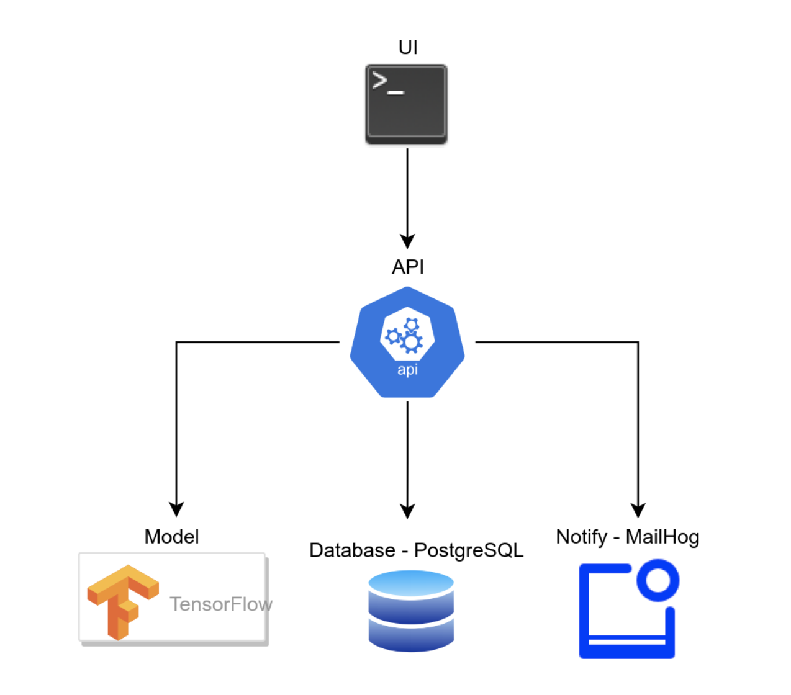

# Deploy the project to a kubernetes cluster

* connect to cluster

## persistent volumes
```bash
kubectl apply -f k8s/db/postgres-pvc.yml
```
## configmaps
### create fastapi configmap
```bash
kubectl create configmap fastapi-config --from-env-file=k8s/api/fastapi.env
```

## deployments
```bash
kubectl apply -f k8s/db/postgres-deployment.yml
kubectl apply -f k8s/api/fastapi-deployment.yml
kubectl apply -f k8s/ui/nodejs-deployment.yml
kubectl apply -f k8s/tfmodel/model-deployment.yml
kubectl apply -f k8s/mailhog/mailhog-deployment.yml
```

## services
```bash
kubectl apply -f k8s/db/postgres-clip.yml
kubectl apply -f k8s/api/fastapi-clip.yml
kubectl apply -f k8s/ui/nodejs-clip.yml
kubectl apply -f k8s/tfmodel/model-clip.yml
kubectl apply -f k8s/mailhog/mailhog-clip.yml

```
## secrets
* pg secret

```bash
kubectl create secret generic pg-user \
--from-literal=PGUSER=<put user name here> \
--from-literal=PGPASSWORD=<put password here>
```
* tls secret
```bash
cd nginx/certs
kubectl create secret generic tls-secret \ 
 --from-file=tls.crt=server.crt \             
 --from-file=tls.key=server.key\             
 --from-file=ca.crt=ca_bundle.crt
```

## ingress

* allow routing. Get the name of your network interface, e.g. eth0 and run
```bash
sudo ufw allow in on eth0 && sudo ufw allow out on eth0
sudo ufw default allow routed
```

* apply ingress yml file(s)
```bash
k apply -f k8s/ingress/ingress.yml
```


## Application overview


